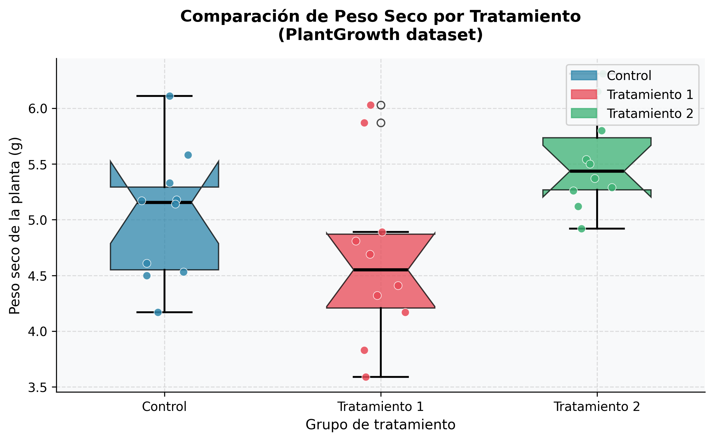
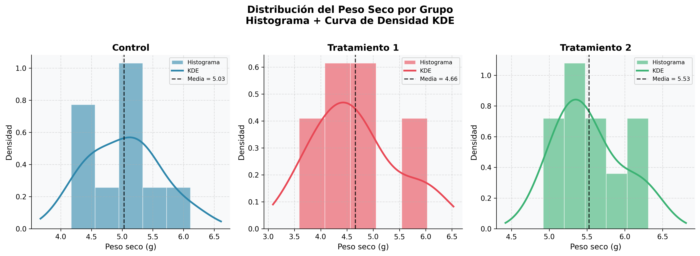
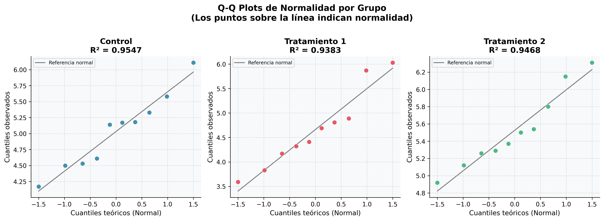
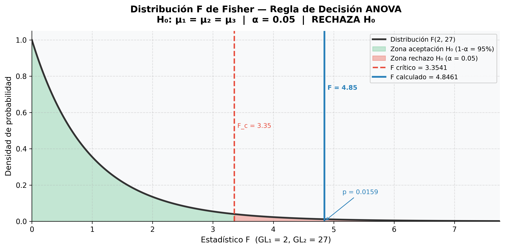

# Reporte Estadístico: Efecto del Tratamiento sobre el Peso Seco de Plantas

**Asignatura:** Estadística Aplicada
**Equipo:** Lizeth Hernández Hernández · Emilio Sánchez Estrada · Carlos Alberto Lule
**Fecha:** 25/04/2026
**Dataset:** PlantGrowth (R Core Team, 2023)

---

## 1. Introducción

Se realizó un análisis de varianza de un factor (ANOVA de una vía) para examinar el efecto de diferentes tratamientos sobre el peso seco de plantas (en gramos). El estudio empleó el **diseño completamente aleatorio (DCA)**, en el que las unidades experimentales fueron asignadas de forma aleatoria a uno de tres grupos: control (*ctrl*), tratamiento 1 (*trt1*) y tratamiento 2 (*trt2*). El conjunto de datos corresponde al dataset `PlantGrowth`, disponible en el entorno base de R (R Core Team, 2023).

---

## 2. Método

### 2.1 Participantes y diseño

El estudio incluyó *N* = 30 observaciones distribuidas equitativamente en tres grupos (*n* = 10 por grupo). El factor independiente fue el tipo de tratamiento (control, tratamiento 1 y tratamiento 2), y la variable dependiente fue el peso seco de las plantas medido en gramos.

### 2.2 Modelo estadístico

El modelo lineal del DCA es:

donde  es la *j*-ésima observación del *i*-ésimo tratamiento,  es la media general,  es el efecto del *i*-ésimo tratamiento, y ) es el error aleatorio.

### 2.3 Hipótesis

### 2.4 Nivel de significancia

Se estableció un nivel de significancia  para todas las pruebas estadísticas.

---

## 3. Resultados

### 3.1 Estadísticas descriptivas

**Tabla 1**
*Estadísticas descriptivas del peso seco de plantas por grupo de tratamiento*

| Grupo         |  *n* | *M* (g) | *DE* (g) | CV (%) | IC 95% inferior | IC 95% superior |
|:--------------|:----:|:-------:|:--------:|:------:|:---------------:|:---------------:|
| Control       |  10  |  5.032  |  0.5832  |  11.59 |     4.615       |     5.449       |
| Tratamiento 1 |  10  |  4.661  |  0.7936  |  17.03 |     4.093       |     5.229       |
| Tratamiento 2 |  10  |  5.526  |  0.4425  |   8.01 |     5.209       |     5.843       |

*Nota.* M = media aritmética; DE = desviación estándar muestral; CV = coeficiente de variación; IC = intervalo de confianza para la media calculado con distribución *t* de Student (*gl* = 9).

Las medias observadas sugieren que el tratamiento 2 produjo plantas con mayor peso seco (*M* = 5.526 g, *DE* = 0.442), seguido por el grupo control (*M* = 5.032 g, *DE* = 0.583) y el tratamiento 1 (*M* = 4.661 g, *DE* = 0.794). El coeficiente de variación indica variabilidad baja en el control (CV = 11.59%) y en trt2 (CV = 8.01%), y variabilidad moderada en trt1 (CV = 17.03%).

#### Figura 1 — Comparación de peso seco por tratamiento (Boxplot)

*Nota.* Cada caja representa el rango intercuartílico (Q1–Q3). La línea central es la mediana. Las muescas indican el IC 95% de la mediana. Los puntos superpuestos corresponden a las observaciones individuales. La ausencia de solapamiento entre las muescas de trt1 y trt2 sugiere diferencia significativa entre sus medianas.

---

#### Figura 2 — Distribución del peso seco por grupo (Histogramas + KDE)

*Nota.* La curva superpuesta corresponde a la estimación de densidad por kernel (KDE) con ancho de banda de Scott. La línea discontinua vertical indica la media del grupo. La forma aproximadamente simétrica y unimodal en los tres grupos es consistente con el supuesto de normalidad.

---

### 3.2 Verificación de supuestos

#### Figura 3 — Q-Q Plots de normalidad por grupo

*Nota.* Los puntos representan los cuantiles observados versus los cuantiles teóricos de una distribución normal estándar. El alineamiento sobre la línea de referencia diagonal indica normalidad. Los valores R² elevados confirman el buen ajuste.

**Normalidad.** Se aplicó la prueba de Shapiro-Wilk a cada grupo. Los resultados no mostraron desviaciones significativas en ningún grupo: control, *W*(10) = 0.9571, *p* = .752; tratamiento 1, *W*(10) = 0.9302, *p* = .449; tratamiento 2, *W*(10) = 0.9411, *p* = .564. Supuesto ✅ **satisfecho**.

**Homogeneidad de varianzas.** La prueba de Levene no reveló diferencias significativas entre varianzas, *F*(2, 27) = 1.119, *p* = .341. Supuesto ✅ **satisfecho**.

**Independencia.** Cada planta constituyó una unidad experimental distinta con asignación completamente aleatoria. Supuesto ✅ **garantizado por diseño**.

---

### 3.3 Análisis de Varianza

**Tabla 2**
*Tabla ANOVA para el efecto del tratamiento sobre el peso seco de las plantas*

| Fuente de variación |  *GL* |    *SC*   |   *CM*   |   *F*  |   *p*  |  *η²*  |
|:--------------------|:-----:|:---------:|:--------:|:------:|:------:|:------:|
| Tratamientos        |   2   |   3.7663  |  1.8832  |  4.846 |  .016  |  .264  |
| Error (Residual)    |  27   |  10.4921  |  0.3886  |   —    |   —    |   —    |
| Total               |  29   |  14.2584  |    —     |   —    |   —    |   —    |

*Nota.* GL = grados de libertad; SC = suma de cuadrados; CM = cuadrado medio; η² = eta cuadrado. Valor crítico F(2, 27) = 3.354 para α = .05.

#### Figura 4 — Distribución F de Fisher con zonas de decisión

*Nota.* La zona sombreada en rojo representa la región de rechazo (α = .05). La línea azul sólida indica el estadístico F calculado (F = 4.846). La línea roja discontinua indica el valor crítico F_c = 3.354. Dado que F calculado > F crítico, se rechaza H₀.

Los resultados indicaron que **existe un efecto significativo del tratamiento**, *F*(2, 27) = 4.846, *p* = .016, η² = .26. El tamaño del efecto indica que el **26.4% de la variabilidad total** en el peso seco es explicado por el tipo de tratamiento — efecto **grande** según Cohen (1988).

---

## 5. Supuestos y Alternativas

| Supuesto violado    | Consecuencia                                                              | Alternativa recomendada                         |
|:--------------------|:--------------------------------------------------------------------------|:------------------------------------------------|
| Normalidad          | El estadístico F pierde robustez; p-valores inexactos                     | Prueba de Kruskal-Wallis (no paramétrica)        |
| Homocedasticidad    | Inflación del error Tipo I; CME estima mal la varianza real               | Welch's ANOVA (ajusta grados de libertad)       |
| Independencia       | Correlación entre residuos; modelo lineal inválido estructuralmente       | ANOVA de medidas repetidas o modelos mixtos     |

En el presente estudio, los tres supuestos fueron satisfechos, confirmando que el ANOVA paramétrico de una vía es el método apropiado.

---

## 6. Conclusión

Los resultados del análisis de varianza indicaron un efecto estadísticamente significativo del tratamiento sobre el peso seco de las plantas, *F*(2, 27) = 4.846, *p* = .016, η² = .26. El tratamiento 2 produjo el mayor peso seco promedio (*M* = 5.526 g), seguido por el grupo control (*M* = 5.032 g) y el tratamiento 1 (*M* = 4.661 g). Se rechaza la hipótesis nula de igualdad de medias a α = .05. Estos resultados sugieren que el tratamiento 2 tiene un efecto positivo sobre el crecimiento de las plantas en comparación con el control y el tratamiento 1.

---

## Referencias

Cohen, J. (1988). *Statistical power analysis for the behavioral sciences* (2nd ed.). Lawrence Erlbaum Associates.

Field, A. (2018). *Discovering statistics using IBM SPSS statistics* (5th ed.). SAGE Publications.

Montgomery, D. C. (2017). *Design and analysis of experiments* (9th ed.). Wiley.